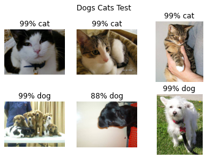
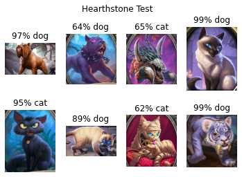
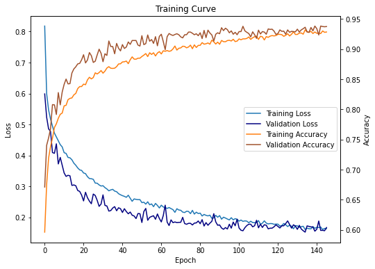

# kaggle-dogs-vs-cats-pytorch

Pytorch implementation for Dogs vs. Cats Redux: Kernels Edition, Kaggle competition. Modified from [Image Classification with Pytorch](https://www.kaggle.com/reukki/pytorch-cnn-tutorial-with-cats-and-dogs/). Homework of Deep Learning, UCAS course 081203M05009H.

Kaggle猫狗分类比赛的Pytorch实现, 修改自[Image Classification with Pytorch](https://www.kaggle.com/reukki/pytorch-cnn-tutorial-with-cats-and-dogs/), 中国科学院大学深度学习作业.





# Requirements

- Colab with P100 GPU and 27.2 gigabytes RAM 
- Python  3.7.10

# Getting Started

## Training on Colab

1. Open `training.ipynb` on [Colab](https://colab.research.google.com/).
2. Create a new folder named `kaggle-dogs-vs-cats-pytorch` which should be located [in](https://english.stackexchange.com/a/43094) `/content/drive/MyDrive/kaggle-dogs-vs-cats-pytorch/` after being mounted.
3. Create some folders in it so as to form the following [file structure](https://stackoverflow.com/a/47795759/12224183).


```bash
├── training.ipynb
├── model
├── result
└── data
    ├── dogs-vs-cats
    │   ├── *.jpg/*.png
    │   └── ...
    ├── hearthstone
        ├── *.jpg/*.png
        └── ...
    └── ...
```

4. Find and classify some pictures to be tested into subfolders of `/data/`.
5. Appropriately modify parameters like batch size, learning rate or epoch size.
6. Run the code. Test results are shown above, while training is demonstrated below.



## Test with Pretrained Model

Run the following code in terminal. Check test results.

``` bash
python test.py -d ./assets/dogs-cats/
```

# License

MIT

# Acknowledgments

- [Image Classification with Pytorch](https://www.kaggle.com/reukki/pytorch-cnn-tutorial-with-cats-and-dogs/)
- Deep Learning, UCAS course, [081203M05009H](http://jwxk.ucas.ac.cn/course/courseplan/185556)